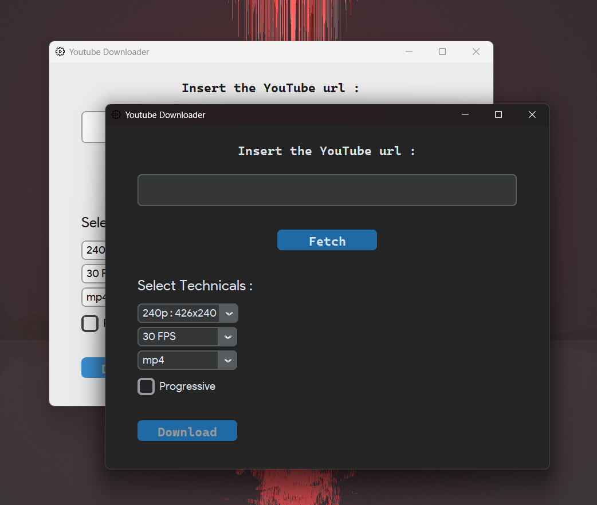

## Pyt-downloader [using python]

Pyt-downloader is a powerful and easy-to-use tool for downloading videos from youtube. This application is designed to be simple and efficient, allowing users to quickly download files by providing a URL.

## 🖼 Preview
<div align="center">
<br>

<br>
</div>

## Installation
#### Clone the repository
```bash
git clone https://github.com/Nishantdd/Pyt-downloader.git pydl && cd pydl 
```
#### Install the required packages
Make sure you have Python installed. You can install the required packages using the following command:
```bash
pip install -r requirements.txt
```
## Usage
```bash
python -u main.py
```

## Features
- Fast and efficient downloading
- Provides multiple streams
- Easy-to-use Graphical User Interface
- Automatically pastes links from clipboard